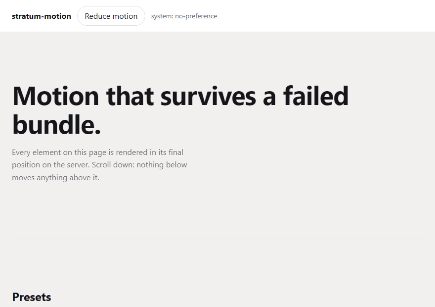

# stratum-motion

[](https://github.com/GeoCodeCrafter/stratum-motion/actions/workflows/ci.yml)
[](LICENSE)

Scroll reveals, parallax, scroll-driven scenes and page transitions for React —
server-safe, dependency-free, and incapable of shifting your layout.

**[Try it →](https://geocodecrafter.github.io/stratum-motion/)**



```tsx
<Reveal preset="fadeUp">
  <h1>Renders visible on the server. Animates on the client.</h1>
</Reveal>
```

---

## Why another motion library

Three failures show up again and again in scroll animation, and all three are
structural rather than accidental:

**Content that never appears.** The usual pattern renders elements at
`opacity: 0` and lets JavaScript fade them in. When the bundle fails, the
browser is old, or the crawler does not execute scripts, the page is blank but
technically fine. Every primitive here renders its *finished* state on the
server. The hidden state is applied on the client, in a layout effect, before
the first paint — so it exists only when there is JavaScript running to undo
it.

**Layout shift.** Animating `height`, `top` or `margin` moves everything after
it and lands directly in your Cumulative Layout Shift score. This library
accepts `opacity`, `transform` and `filter` and nothing else: any other
property throws a `LayoutShiftError` naming the composited alternative.

**Motion preferences treated as decoration.** `prefers-reduced-motion` is a
medical setting for a good number of the people who turn it on. Under it, this
library removes movement — every preset collapses to a short cross-fade,
parallax stops entirely, scroll scenes pin to their finished state — while
keeping all of the content.

## Install

```bash
npm install stratum-motion
```

React 18 or 19 as a peer dependency. No other dependencies at all.

## Quick start

```tsx
import { Reveal, Stagger, Parallax, ScrollScene, MotionConfig } from 'stratum-motion';

export default function Page() {
  return (
    <MotionConfig defaultDuration={600} defaultEasing="emphasised">
      <Reveal as="h1" preset="rise">
        Sections that arrive properly
      </Reveal>

      <Stagger as="ul" step={80} from="center">
        {items.map((item) => (
          <Reveal as="li" key={item.id} preset="fadeUp">
            {item.title}
          </Reveal>
        ))}
      </Stagger>

      <Parallax speed={0.3}>
        
      </Parallax>

      <ScrollScene>{({ progress }) => <ProgressRing value={progress} />}</ScrollScene>
    </MotionConfig>
  );
}
```

## Components

### `<Reveal>`

Animates an element in when it enters the viewport.

| Prop | Type | Default | Notes |
| --- | --- | --- | --- |
| `preset` | `PresetName \| Transition` | `'fadeUp'` | Name, or a literal `{ from, to }` |
| `duration` | `number` | `600` | Milliseconds |
| `delay` | `number` | `0` | Added to any inherited stagger delay |
| `easing` | `Easing` | `'emphasised'` | Name or raw CSS timing function |
| `once` | `boolean` | `true` | `false` re-hides the element on exit |
| `amount` | `number` | `0.2` | Fraction visible before triggering |
| `rootMargin` | `string` | `'0px'` | Grows or shrinks the trigger area |
| `distance` / `scaleFrom` / `blur` | `number` | per preset | Preset options |
| `as` | `ElementType` | `'div'` | Render as any element |
| `onReveal` | `() => void` | — | Fires once the animation settles |

Rendered elements carry `data-stratum-state="idle" | "revealing" | "revealed"`,
which is convenient for both CSS and end-to-end tests.

### `<Stagger>`

Offsets each child's reveal. Delays come from each child's *position*, not from
a counter incremented during render, so a StrictMode double render cannot
scramble them. Nested `Stagger`s add to the outer delay.

```tsx
<Stagger step={80} from="center">…</Stagger>
```

`from` accepts `'first'`, `'last'`, `'center'` or `'edges'`. Whichever you
choose, someone always starts at zero — no dead time at the front.

### `<Parallax>`

Translates its contents as the page scrolls. The wrapper's own box never moves,
so a drifting layer cannot push anything around. Transforms are written straight
to the node rather than through React state: sixty state updates a second for a
value only the compositor needs is a re-render you do not want.

```tsx
<Parallax speed={0.3} axis="y">…</Parallax>
```

Speed is a fraction of the scroll distance; negatives invert it. Offsets are
centred on the element's midpoint, so a layer sits exactly where it belongs at
the moment the reader is looking at it. `requiredOverscan(speed, travel)` gives
the bleed a background layer needs so its edges never show.

### `<ScrollScene>`

Hands scroll progress (0–1) to a render prop — the escape hatch for canvases,
Three.js cameras, SVG paths, anything the presets do not cover.

```tsx
<ScrollScene range="cover" precision={2}>
  {({ progress, reduced }) => <Camera z={progress * 10} />}
</ScrollScene>
```

`range` is `'cover'`, `'contain'`, `'enter'` or `'exit'`. `precision` sets how
much the value must change before React re-renders.

### `<PageTransition>`

Cross-fades between routes. The outgoing children stay mounted until their exit
finishes, then the new ones swap in and animate. Exit runs at a third of the
entry duration by default: a slow exit is what users read as a sluggish site,
because nothing they asked for is on screen yet.

```tsx
'use client';

const pathname = usePathname();

<PageTransition transitionKey={pathname}>{children}</PageTransition>;
```

### `<MotionConfig>`

Defaults for everything below it — `reducedMotion`, `durationScale`,
`defaultDuration`, `defaultEasing`, `disabled`. Nested providers inherit rather
than reset, so a section can slow itself down without restating the rest.
`disabled` turns every animation into an instant, final-state render, which is
what you want in a test suite.

## Hooks

| Hook | Returns | Purpose |
| --- | --- | --- |
| `useReducedMotion()` | `boolean` | The preference to obey, including config overrides |
| `useSystemReducedMotion()` | `boolean` | The raw OS setting |
| `useInView(ref, options)` | `boolean` | Pooled IntersectionObserver, fails open |
| `useScrollProgress(ref, options)` | `number` | 0–1, measured on the shared frame loop |
| `useParallax(ref, options)` | `void` | Writes transforms outside React |

## Presets

`fade` · `fadeUp` · `fadeDown` · `fadeLeft` · `fadeRight` · `scaleIn` ·
`scaleOut` · `blurIn` · `rise` · `tilt`

Every one starts invisible, ends at rest, and produces nothing but `opacity`,
`transform` and `filter` — asserted in the test suite for all ten. Pass a
literal `{ from, to }` to `preset` for anything else; it goes through the same
validation.

## Reduced motion

| Primitive | Under `prefers-reduced-motion: reduce` |
| --- | --- |
| `Reveal` | 200 ms cross-fade, no movement of any kind |
| `Stagger` | Delays still apply, to the fades |
| `Parallax` | Nothing moves; no frame loop is even subscribed |
| `ScrollScene` | `progress` pins to 1 — the finished state, not the first frame |
| `PageTransition` | Cross-fade only |

The preference is read through `useSyncExternalStore`, so changing it mid
session takes effect immediately — which matters, because people often change
it *because* something on the page made them ill.

## Server rendering

Nothing in this library touches `window`, `document` or `matchMedia` during
render. `useLayoutEffect` is swapped for `useEffect` on the server, so there is
no warning, and the hidden state is applied in a client layout effect before
paint, so there is no flash of visible content either.

The test suite runs the whole component set through `renderToString` in a node
environment and asserts the output contains no `opacity:0`, no `transform` and
no `visibility:hidden`; a second suite hydrates that markup and asserts React
reports no mismatch. The demo is prerendered and hydrated for the same reason,
and the end-to-end suite loads it with JavaScript disabled to confirm the page
is complete without it.

## Performance

- **One IntersectionObserver per configuration**, not per element. Fifty
  reveals sharing a threshold cost one observer.
- **One `requestAnimationFrame` loop** for every parallax layer and scroll
  scene on the page.
- **Composited properties only**, enforced at runtime.
- **No dependencies**, no runtime CSS, tree-shakeable, `sideEffects: false`.

## What is verified, and how

| Claim | Checked by |
| --- | --- |
| Content is visible without JavaScript | `renderToString` assertions, plus a Playwright run with JS disabled |
| Hydration is clean | A hydration suite asserting no React warnings |
| No layout shift | The property allowlist, plus a CLS budget of 0.01 measured while scrolling |
| Reduced motion removes movement | Unit assertions per primitive, plus Playwright with the media feature emulated |
| The public API does not drift | A test that pins the full export list |

```bash
npm test
```

```bash
npm run test:e2e
```

```bash
npm run demo
```

## Browser support

Anything with IntersectionObserver and the Web Animations API — Chrome 84+,
Firefox 75+, Safari 13.1+. Without WAAPI, elements snap to their final state;
without IntersectionObserver, they render visible immediately. Both fallbacks
lose the animation and keep the content.

## The GIF above

Generated rather than screen-recorded:

```bash
npm run demo &
npm run demo:gif
```

Playwright scrolls the demo and `gifenc` encodes the frames. Playwright bundles
an ffmpeg, but it's a stripped webm-only build with no GIF muxer.

The one thing that matters in that script is waiting ~90ms after each scroll
step before screenshotting. Without it every element is caught at frame zero of
its own reveal, and you get a GIF of a motion library that appears to do nothing.

## Licence

MIT © OpusDevs
